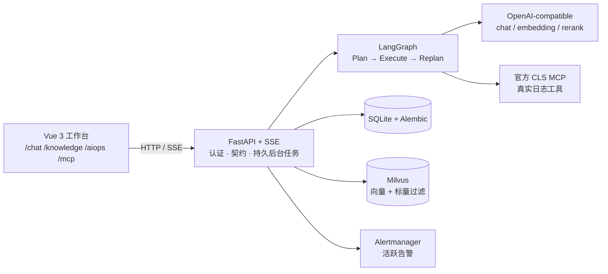

<div align="center">

# 信息采集装置智能运维 Agent 系统复现

把"告警进来 → 拉日志取证 → 出诊断报告"这条运维链路，用 Agent 的方式重新实现一遍。

[](./LICENSE)
[](https://www.python.org/)
[](https://fastapi.tiangolo.com/)
[](https://vuejs.org/)
[](https://www.typescriptlang.org/)
[](https://langchain-ai.github.io/langgraph/)
[](https://modelcontextprotocol.io/)
[](./openspec)

</div>

---

## 这个项目是什么

这是我参照自己之前的项目经验，把信息采集装置的运维流程重新实现的一遍——告警接入、日志检索、
知识库检索、诊断报告、案例沉淀这些环节都在，但做法换了一套：**先用 OpenSpec 把规格写清楚，
再按规格实现、验证、归档。**

上一版是边写边改，做完之后说不清某个设计当时为什么定成这样。所以这一版每加一个能力，都先在
`openspec/` 里写清楚要求、可验收的场景和任务，实现完再归档。仓库里每一处设计都能追到对应的规格
和提案，这部分是我想重点展示的。

有一点提前说明：**仓库里的日志、告警和知识库文档都是为了演示构造的**，不是线上数据。我按十个典型
故障模式做了配套的 fixtures（每个场景四条有序日志 + 一条告警 + 一份 SOP 文档），用来把整条链路完整
跑一遍。模型、向量库、日志服务这些外部依赖要自己配凭据；没配的时候程序会明确报 unavailable，
不会拿假数据顶上去。

## 当前已实现的功能

| 模块 | 做了什么 |
|---|---|
| 认证与隔离 | 本地注册登录、Argon2 密码、可撤销 token；业务数据按 owner / tenant 隔离 |
| 聊天 | 持久 SSE 流式 Agent，工具调用审计，会话记忆压缩（30 轮 / 70% 触发、95% 熔断） |
| 知识库 | 文档上传、切片、embedding 入 Milvus；BM25L 与向量双路召回、RRF 融合、rerank 精排 |
| 智能诊断 | LangGraph 编排 Plan → Execute → Replan：真实日志工具取证、结构化执行总账、证据门禁、诊断报告、案例沉淀 |
| MCP | 官方腾讯云 CLS MCP 的真实连接与工具发现，按用户隔离，超时 / 重试 / 同名冲突都有边界，全程审计脱敏 |
| 可复现 | 10 套 Java 电商故障 fixtures（日志 + 告警 + SOP），可以完整重放一次真实诊断 |

## 整体结构



| 路径 | 内容 |
|---|---|
| `apps/backend` | FastAPI、SQLite Repository、Agent 与 AIOps 运行时 |
| `apps/frontend` | Vue 3 中文工作台（`/chat`、`/knowledge`、`/aiops`、`/mcp`） |
| `packages/api-contracts` | HTTP、OpenAPI 与 SSE 的单一事实来源 |
| `config` | 可提交的空模板，以及被 git 忽略的本机配置 |
| `infra` | etcd、MinIO、Milvus、Attu、Alertmanager 五服务 Compose |
| `scripts` | 本地启动器，以及需要显式执行的 fixtures |
| `openspec` | 主规格与归档的变更 |
| `docs` | VitePress 文档、安装、运维、教程与 runbook |

## 本地跑起来（五步）

### 1. 前置依赖

| 需要什么 | 说明 |
|---|---|
| Docker Desktop | 要先打开。五个容器（etcd / MinIO / Milvus / Attu / Alertmanager）跑在里面，镜像版本固定在 `infra/compose.yaml`，不用自己找镜像 |
| Node.js 20+ 与 npm | 前端工作台和官方 CLS MCP |
| uv | 后端依赖与虚拟环境（Python 3.10+） |
| npx | 用 `npx -y cls-mcp-server@latest` 在主机上启动官方腾讯云 CLS MCP（不进容器） |

各平台细节见 `docs/setup/macos.md`、`docs/setup/linux.md`、`docs/setup/windows.md`。

### 2. 生成两份本地配置

```bash
cp config/project.template.json config/project.json
cp config/user.project.template.json config/user.project.json
```

这两份文件都在 `.gitignore` 里，不会被提交。模板里的密钥字段是空的；程序只读这两份本地 JSON
递归深合并后的结果，不从环境变量里取凭据。

### 3. 填凭据

写在 `config/user.project.json` 里：

| 字段 | 用途 |
|---|---|
| `llm.chat.apiKey` | 聊天模型（默认走 DeepSeek 的端点） |
| `llm.apiKey` | embedding 与 rerank（阿里云百炼） |
| `clsMcpServer.secretId` / `secretKey` | 官方 CLS MCP 的真实日志工具 |
| `clsLogUpload.*` | 上传演示日志用的日志集与主题 |
| `aiopsDemo.email` / `password` | 演示账号，跑示例脚本时才需要 |

`config/project.json` 放不需要保密的东西（模型名、端点、端口）。换模型时改两处：`llm.chat.model`，
以及 `modelCapabilities` 里同名的 `contextWindowTokens`；换厂商再加 `llm.chat.baseUrl`。规则见
`docs/architecture/model-providers.md`。

不要把 token 或 secret 写进 MCP 的 URL 参数里，也不要把这两份本机配置提交上去。

### 4. 启动

一条命令做完：起五个容器、`uv sync`、Alembic 迁移、启动官方 CLS MCP（凭据齐备时）、FastAPI 和 Vite。

macOS、Linux 或 Git Bash：

```bash
./scripts/start-local.sh
```

Windows cmd 或 PowerShell：

```bat
scripts\start-local.bat
```

日志写在 `apps/backend/var`。普通启动不会上传日志、发告警或写入 SOP，这些是单独执行的 fixture，
顺序见 `docs/tutorials/real-log-and-alert.md`。

要停服务就执行：

```bash
./scripts/stop-local.sh            # 只停后端、前端、官方 CLS MCP
./scripts/stop-local.sh --infra    # 连五个容器一起停（数据卷保留）
```

Windows 在启动脚本那个窗口按 `Ctrl+C`，容器用 `docker compose -f infra/compose.yaml down`。

### 5. 确认起来了

```bash
curl -s http://127.0.0.1:8000/ready
```

返回 `ok: true`，并且 `sqlite` / `milvus` / `qwen` / `mcp` 四项都是 ready，就说明这次启动是完整的。

其中 `qwen` 这一项探的其实是聊天模型（可以是 DeepSeek 这类任何 OpenAI-compatible 端点），`milvus`
依赖 embedding 的凭据。没填凭据时这两项会显示 unavailable 并给出原因——页面照样能打开、能注册登录，
只是没有凭据的那部分功能不会假装成功。

## 端口

| 服务 | 地址 | 形态 |
|---|---|---|
| 前端 | http://127.0.0.1:5173 | 主机进程 |
| 后端 / OpenAPI | http://127.0.0.1:8000 · `/docs` | 主机进程 |
| 健康与观测 | `/health`、`/ready`、`/config/check`、`/metrics` | 主机进程 |
| 官方 CLS MCP | http://127.0.0.1:3001/mcp | 主机进程，不在容器里 |
| Attu | http://127.0.0.1:3000 | 容器 |
| Alertmanager | http://127.0.0.1:9093 | 容器 |
| Milvus / MinIO | 19530 / 9000 | 容器 |

> macOS 上开着 ClashX、Surge 这类代理时要注意：它们会把 `127.0.0.1` 的请求也转发出去，表现为后端
> 日志里连的是代理端口（比如 7890），MCP 一直连不上、`/ready` 报 `mcp: unavailable`。启动后端前加
> 一次环境变量就能绕开：`NO_PROXY="127.0.0.1,localhost" no_proxy="127.0.0.1,localhost"`。

## 怎么验证

```bash
openspec validate --all
npm run contracts:typecheck
npm run contracts:test
cd apps/backend
uv sync
uv run alembic upgrade head
uv run ruff check .
uv run pyright
uv run pytest
cd ../..
npm run frontend:typecheck
npm run frontend:test
npm run frontend:build
npm run docs:build
uv run --project apps/backend python scripts/sync_wiki.py audit-includes
uv run --project apps/backend python scripts/sync_wiki.py audit-counts
docker compose -f infra/compose.yaml config
bash -n scripts/start-local.sh
git diff --check
```

自动化测试用的是临时配置和注入进来的外部边界，证明的是代码合同；真实模型、Milvus、CLS MCP 这几条
链路要配好凭据后在本机跑一遍。

## 文档在哪

| 想了解 | 看哪里 |
|---|---|
| 安装与首次启动 | `docs/setup/`、`docs/operations-and-monitoring.md` |
| 架构与模型供应商 | `docs/architecture/` |
| 演示日志和告警的重放顺序 | `docs/tutorials/real-log-and-alert.md` |
| 各能力的验收标准 | `openspec/specs/` |
| 每个变更的提案、设计、任务 | `docs/changes/`（VitePress 页面，由 `scripts/sync_wiki.py` 生成） |
| 本地冒烟流程 | `docs/runbooks/` |

`docs/openspec` 是指向仓库 `openspec` 的相对符号链接，文档站用 VitePress 的 include 直接展示原始
artifacts，不复制正文。新建变更后跑 `uv run --project apps/backend python scripts/sync_wiki.py active`，
归档后跑 `... archive --change <change-name>`，全量重建用 `... all`。

```bash
npm run docs:dev
npm run docs:build
npm run docs:preview
```

Windows 上 checkout 要先打开 Developer Mode 并启用 Git 的 symlink 支持，不能把 `openspec` 目录复制成
普通目录，具体检查见 `docs/setup/windows.md`。

文档里的规格和提案用简体中文写，提交信息遵循 Conventional Commits。

## 许可证

[MIT](./LICENSE)
