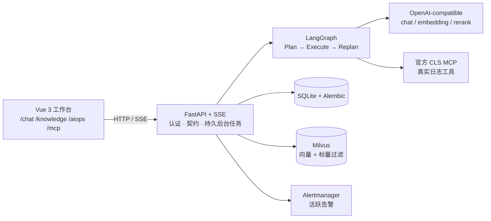

<div align="center">

# 🛰️ 智能 OnCall Agent

**本地优先、OpenSpec 驱动的 AIOps 工作台**

用一句自然语言排查线上告警：真实日志检索 → 证据链 → 可信报告 → 沉淀成案例

[](./LICENSE)
[](https://www.python.org/)
[](https://fastapi.tiangolo.com/)
[](https://vuejs.org/)
[](https://www.typescriptlang.org/)
[](https://langchain-ai.github.io/langgraph/)
[](https://modelcontextprotocol.io/)
[](./openspec)

</div>

---

## ✨ 它是什么

一个本地优先的 monorepo：Vue 3 中文工作台 + FastAPI 后端，把"告警 → 排查 → 报告"这条链路做成
**有证据、可追溯、不编造**的流程。外部能力（大模型、向量库、日志服务）只有在本机配置真实凭据
并启动对应服务后才连通；没有凭据时会明确报告 unavailable，不会伪造结果。

## 🧩 已实现的能力

| 模块 | 做了什么 |
|---|---|
| 🔐 认证与隔离 | 本地注册登录、Argon2 密码、可撤销 token；所有业务数据按 owner / tenant 强隔离 |
| 💬 聊天 | 持久 SSE 流式 Agent，工具调用审计，会话记忆压缩（30 轮 / 70% 触发、95% 熔断） |
| 📚 知识库 | 文档上传 → 切片 → embedding → Milvus 索引；BM25L + 向量双路召回、RRF 融合、rerank 精排 |
| 🚨 智能诊断 | LangGraph 编排 Plan → Execute → Replan：真实日志工具取证、结构化执行总账、证据门禁、可信报告、案例沉淀 |
| 🔌 MCP | 官方腾讯云 CLS MCP 真实连接与工具发现，按用户隔离，超时 / 重试 / 同名冲突有界，全程审计脱敏 |
| 🧪 可复现 | 10 套关联式 Java 电商故障 fixtures（日志 + 告警 + SOP），可完整重放一次真实诊断 |

## 🧭 架构一览



设计取舍、证据门禁与三个诊断节点的职责，见 `docs/architecture/` 与 `openspec/specs/`。

## 📁 目录

| 路径 | 内容 |
|---|---|
| `apps/backend` | FastAPI、SQLite Repository、Agent / AIOps 运行时 |
| `apps/frontend` | Vue 3 中文桌面工作台（`/chat`、`/knowledge`、`/aiops`、`/mcp`） |
| `packages/api-contracts` | HTTP、OpenAPI 与 SSE 的单一事实来源 |
| `config` | 可提交的空模板 + ignored 的本机 JSON |
| `infra` | 仅 etcd、MinIO、Milvus、Attu、Alertmanager 五服务 Compose |
| `scripts` | 本地启动器与需要显式执行的 fixtures |
| `openspec` | 主规格与归档 change |
| `docs` | VitePress WIKI、安装、运维、教程与 runbook |

## 🚀 第一次运行（照着做五步）

### 1. 前置依赖

| 需要什么 | 说明 |
|---|---|
| Docker Desktop | 必须**先打开**。五服务 Compose（etcd / MinIO / Milvus / Attu / Alertmanager）跑在容器里；镜像版本固定在 `infra/compose.yaml`，无需自行寻找 |
| Node.js 20+ 与 npm | 前端工作台与官方 CLS MCP |
| uv | 后端依赖与虚拟环境（Python 3.10+） |
| npx | 以 `npx -y cls-mcp-server@latest` 在主机启动官方腾讯云 CLS MCP（**不进 Compose**） |

各平台细节见 `docs/setup/macos.md`、`docs/setup/linux.md`、`docs/setup/windows.md`。

### 2. 生成两份本地配置

```bash
cp config/project.template.json config/project.json
cp config/user.project.template.json config/user.project.json
```

两份文件都在 `.gitignore` 里，**永远不会被提交**。模板中的密钥字段是空的；程序只读这两份本地 JSON
的递归深合并结果，不从环境变量补取凭据。

### 3. 填凭据（不填也能启动，但对应能力会明确报 unavailable）

写在 `config/user.project.json`（这是唯一的密钥落点）：

| 字段 | 用途 | 不填的后果 |
|---|---|---|
| `llm.chat.apiKey` | 聊天模型（默认 DeepSeek 端点） | 聊天与 AIOps 诊断不可用 |
| `llm.apiKey` | embedding 与 rerank（百炼） | 知识库上传 / 检索不可用 |
| `clsMcpServer.secretId` / `secretKey` | 官方 CLS MCP 的真实日志工具 | `/ready` 的 mcp 显示 unavailable |
| `clsLogUpload.*` | 上传示例日志用的日志集 / 主题 | 只有跑示例 fixtures 时才需要 |
| `aiopsDemo.email` / `password` | 演示账号（可选） | 只有示例脚本需要 |

`config/project.json` 放非密钥的默认值（模型名、端点、端口）。换模型时改 `llm.chat.model` 和
`modelCapabilities` 里**同名**的 `contextWindowTokens` 两处；换厂商再加 `llm.chat.baseUrl`，
规则见 `docs/architecture/model-providers.md`。

不要把 token / secret 放进 MCP URL query，也不要提交这两份本机 JSON。

### 4. 启动

一条命令完成：五服务 Compose → `uv sync` → Alembic 迁移 → 官方 CLS MCP（仅凭据齐备时）→ FastAPI → Vite。

macOS、Linux 或 Git Bash：

```bash
./scripts/start-local.sh
```

Windows cmd 或 PowerShell：

```bat
scripts\start-local.bat
```

日志写入 ignored 的 `apps/backend/var`。普通启动不会上传 CLS 日志、发布告警或 seed SOP；
这些是需要显式执行的 fixtures，见 `docs/tutorials/real-log-and-alert.md`。

### 5. 验证跑起来了

```bash
curl -s http://127.0.0.1:8000/ready
```

`ok: true` 且 `sqlite` / `milvus` / `qwen` / `mcp` 四项都 ready，就说明这一轮启动是完整的。

其中 `qwen` 这一项实际探测的是**聊天模型**（可以是 DeepSeek 等任何 OpenAI-compatible 端点），
`milvus` 依赖 embedding 凭据。**没有填对应凭据时这两项会显示 unavailable 并给出原因，这是如实报告，
不是崩溃**：页面能打开、能注册登录，但没有凭据的聊天 / 检索 / 诊断不会假装成功。

## 🔌 端口与依赖

| 服务 | 地址 | 形态 |
|---|---|---|
| 前端 | http://127.0.0.1:5173 | 主机进程 |
| 后端 / OpenAPI | http://127.0.0.1:8000 · `/docs` | 主机进程 |
| 健康与观测 | `/health`、`/ready`、`/config/check`、`/metrics` | 主机进程 |
| 官方 CLS MCP | http://127.0.0.1:3001/mcp | 主机进程（**不是容器**） |
| Attu | http://127.0.0.1:3000 | 容器 |
| Alertmanager | http://127.0.0.1:9093 | 容器 |
| Milvus / MinIO | 19530 / 9000 | 容器 |

> **开着系统代理的 macOS 用户注意**：ClashX、Surge 之类的代理会把 `127.0.0.1` 的请求也转发出去，
> 表现为后端日志里连的是代理端口（例如 7890），MCP 一直连不上而 `/ready` 报 `mcp: unavailable`。
> 启动后端前加一次环境变量即可绕开：
> `NO_PROXY="127.0.0.1,localhost" no_proxy="127.0.0.1,localhost"`。

## ✅ 全量验证

```bash
openspec validate --all
npm run contracts:typecheck
npm run contracts:test
cd apps/backend
uv sync
uv run alembic upgrade head
uv run ruff check .
uv run pyright
uv run pytest
cd ../..
npm run frontend:typecheck
npm run frontend:test
npm run frontend:build
npm run docs:build
uv run --project apps/backend python scripts/sync_wiki.py audit-includes
uv run --project apps/backend python scripts/sync_wiki.py audit-counts
docker compose -f infra/compose.yaml config
bash -n scripts/start-local.sh
git diff --check
```

自动测试使用临时配置与注入式外部边界，只证明代码合同；真实模型 / Milvus / CLS MCP / CLS / Alertmanager
链路需要具备环境后人工执行并如实记录。Windows 的 `start-local.bat` 尚未在真实 cmd / PowerShell 验证，
不能用 Bash 代替。

## ⚠️ 已知限制

如实列出，避免把"没做"说成"已做"：

- **一次诊断带多条告警时只覆盖其中一条的日志检索**：其余告警没有证据，报告会诚实判为"证据不足"。
  演示请选**单条**告警发起诊断。
- **CLS 的告警类工具在本地 fixture 下返回空**：本项目的活跃告警来自 Alertmanager，不是 CLS 自身的告警接口。
- **工具出参只校验结构、不校验合理性**：类型合法但值明显错误的产出不会被拦下。
- **没有 CI**：全量验证目前是本地手动执行（命令见上）。
- **Windows 启动脚本未在真实环境验证**。

## 📖 文档导航

| 想了解 | 看哪里 |
|---|---|
| 安装与首次启动 | `docs/setup/`、`docs/operations-and-monitoring.md` |
| 架构与模型供应商 | `docs/architecture/` |
| 真实日志与告警的重放顺序 | `docs/tutorials/real-log-and-alert.md` |
| 各能力的验收标准 | `openspec/specs/` |
| 每个变更的提案 / 设计 / 任务 | `docs/changes/`（VitePress WIKI，由 `scripts/sync_wiki.py` 生成） |
| 本地冒烟流程 | `docs/runbooks/` |

`docs/openspec` 是指向仓库 `openspec` 的相对符号链接；WIKI 通过 VitePress include 展示原始 artifacts，
不复制正文。创建 active change 后运行 `uv run --project apps/backend python scripts/sync_wiki.py active`，
归档后运行 `... archive --change <change-name>`，全量重建用 `... all`。

```bash
npm run docs:dev
npm run docs:build
npm run docs:preview
```

Windows checkout 必须先启用 Developer Mode 和 Git symlink 支持，不能复制 `openspec` 目录作为 fallback，
具体检查见 `docs/setup/windows.md`。

OpenSpec 文档使用简体中文，提交遵循 Conventional Commits。

## 📄 许可证

[MIT](./LICENSE) © 2026 哈嘞
